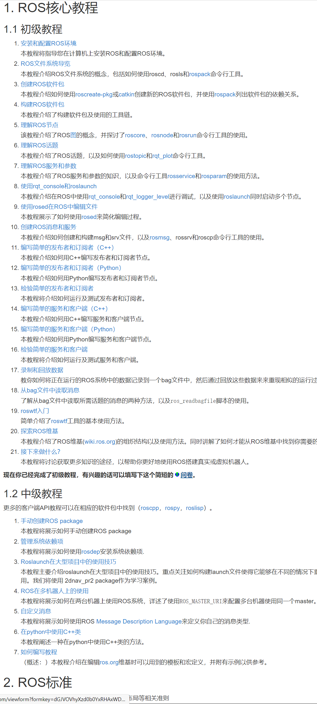
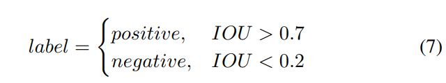
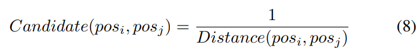
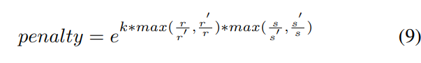
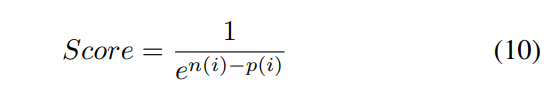
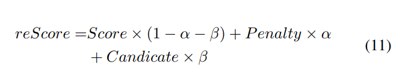
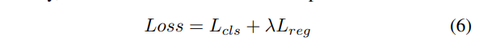

Author: 郑深生
Date: 2021/06/14 - 2021/06/20

## 工作进展

### ROS Melodic系统学习

#### 进展

主要参考[官网ROS的教程]([cn/ROS/Tutorials - ROS Wiki](http://wiki.ros.org/cn/ROS/Tutorials))进行上手学习

官网教程目录分六章，目前主要学习了第一部分[ROS核心教程](http://wiki.ros.org/cn/ROS/Tutorials#ROS.2BaDhfw2VZegs-)，内容目录如下

#### 问题

1. 目前能够根据教程把样例都调通跑通，理解了基本的Ros命令工具和启动流程，但感觉自己还是比较缺乏实战经验，很可能现在学完后续就忘记了
2. 教程给的例子并不复杂，也不具有工程项目实践意义，感觉需要一点项目实战，但在github上并没有看到适合的入门项目

### 论文阅读

1. [SiamFPN](https://ieeexplore.ieee.org/stamp/stamp.jsp?tp=&arnumber=9024119)

   + 和以前读过的检测文章相比，更像是检测算法在某一工程领域的具体落地实现，数据预处理和后处理方法用了不少的tricks.

   + 一个Two-stage的Anchor-based算法

     + anchor-based的设定通过对数据集进行5类的k-means划分得到anchor的宽高的比例因子(如果换新的模型数据集那要重新微调训练？)

   + 算法主要三部分组成

     + ResNet-50 + FPN组成的Siamese Network

       使用FPN是希望能够适应目标的多尺度的特征变换，比较特殊的地方有ResNet-50网络的conv4, conv5的分辨率取的都是是8而不是16和32，这似乎是为了适应检测目标，避免错过一些小目标检测

       自己本科毕设在FPN上尝试学习过的改进有[ASFF](https://arxiv.org/pdf/1911.09516.pdf)，主要解决特征尺度不一致的问题，在小目标上有不小的提升。

     + 并行的RPN

       增强目标的差异性

       按照IOU阙值生成正负样本，随机挑选，但保持正负比例在1：3

       

       感觉目前的正负样本分配策略比较随机和人为设计，或许可以参考[ATSS](https://arxiv.org/pdf/1912.02424.pdf)自动正负样本分配获取

     +   proposal selection strategy

       + 第一个策略是考虑历史轨迹, 考虑两个预测位置之间的曼哈顿距离，解决小范围幅度内的目标抖动问题

         

       + 第二个策略是考虑目标大小的改变，参考SiamRPN引入惩罚项系数，惩戒远离前一帧的请求框

         

       + 第三个策略是分数计算策略，这个计算式为什么是按照这样子计算，暂时没懂

         论文中说**Therefore, we set the threshold of score to 0.6 to decide whether call the prediction method.** 来应对目标剧烈的抖动, 我对于这个方法是否能够应对目标的剧烈变化，存疑？**以及为什么是使用n(i)-p(i)的形式进行分数计算**

         

       + 第四个策略是结合前面三个策略的一个重打分计算后结合NMS进行后续处理
       
         
       
       + 感觉策略里面人工设计的超参数确实很多，调试起来感觉比较麻烦

   + 模型的损失函数

     + 回归损失

       貌似RPN系列基本都是沿用$smoothL1$损失函数

       **疑问：使用用IOU,GIOU,DIOU这类的损失函数是否能取得更好的效果？**

     + 分类损失

       使用的是RetinaNet提出的Focal Loss，改进了SiamRPN使用的交叉熵损失函数，能够调节正负样本权重的同时和学习到难样本与容易样本。

     + 总损失函数

       

       **疑问：公式里面回归损失的计算我理解是对负样本的也进行计算了，但是背景应该负样本，应该是不用回归学习的，在Yolo系列，RetinaNet系列、faster-rcnn系列都不对背景负样本进行学习，在SiamRPN这系列中为什么开始学习负样本背景呢**

       沿用$smoothL1$损失做回归损失函数并且同样是基于区域生成方式的统一样本加权网络[SWN](https://arxiv.org/pdf/2006.06568.pdf)，可在不影响推理速度的情况下实现性能提升。

   + 数据集

     + 224 video segments are collected, with a total of 33018 frames.
     + 25404 frames for training, 3000 frames for validation and 3931 for testing, respectively
     + the dataset is divided into 6 categories according to different shapes, cargo ship, fishing boat, passenger ship, speed boat, unmanned ship and sailboat.

   + 评价指标

     +  Average overlap ratios

       N个帧中预测框和标签框的的平均IOU

     + Average distance

       N个帧中预测框和标签框的平均欧几里得距离

     + Frame Per Second(FPS)

       主要是同一机器上评测，感觉机器性能太差，FPS不会很好看

     + Precision

       The Precision is the ratio of the number of successful frames to total number of frames in all sequences

     +  Success Rate

       The success rate is the ratio of the number of successful frames to total number of frames in all sequences.

       (Recall rate in ML?)

     + 疑问

       不用画AP和mAP进一步评价嘛

   + 实验分析

     + Shakings

        SiamFPN keeps a stable high level performance during the whole tracking process.

     + rotation and small target

       While a dropoff happens when deforming, SiamFPN restores quickly to the stable tracking performance.

     + Background

       The top performance is achieved by SiamFPN with an average overlap 0.85 during the whole tracking process.

     + Appearance

       我的理解是差异性变化适应良好

       Moreover, SiamFPN performs well and keep the overlap above 0.5 in the whole tracking process

     +  stable track

        In such a long-range tracking condition, ships are too small to be confused with other targets or possible noise. Nevertheless, the targets demonstrate a steady course, which makes the correlation address more than other features. Therefore, in terms of using the correlation, KCF performs better than other tracking methods.

       长期追踪目前效果不够好

   + 不足

     However, the proposed tracker can only work in the limited weather conditions and vessel types, and more datasets are required to cover complex maritime environment and improve tracking performance.

     我的理解是目前限制比较大，主要限制在特定的天气条件和船舶上，需要更复杂的数据集进行检测提升，**未来改进是需要引入更多的数据或者是考虑类似引入其他领域知识的方法来泛化模型性能？**

   + **一些领域方向疑问**

     + 这个方向和领域内目前有Anchor-free的算法(比如YOLOv4, YOLOv5, FCOS, CenterNet(不过这些好像都是2d检测))的检测追踪模型吗

     + SiamFPN和SiamRPN应该不算一个端到端的训练网络模型？

       按照类似[FCOS](https://arxiv.org/pdf/1904.01355.pdf)的理解，其有后处理方法NMS，不能算是完全的End to End

       我的理解中End to End应该是[DETR](https://arxiv.org/abs/2005.12872)和[End-to-End Object Detection with Fully Convolutional Network](https://arxiv.org/pdf/2012.03544.pdf)

     + 对于3d检测追踪和2d检测的异同处理，除了时序上下文，语义信息之类还有那些不同呢

     + 目前对这个数据集理解的不是很深刻，恶劣的天气条件都有拿一些？会需要类似图像去雾，去雨这样的处理数据集吗? 或者说已经处理过了

2. [SiamRPN]([High Performance Visual Tracking With Siamese Region Proposal Network (thecvf.com)](https://openaccess.thecvf.com/content_cvpr_2018/papers/Li_High_Performance_Visual_CVPR_2018_paper.pdf)）

   + 目前是泛读
   + 主要是想和SiamFPN参考对比一下有哪些不同
   + 之后应该会试着研读一下[SiamRPN的Pytorch实现](https://github.com/NieHa0ha0/siamrpn-pytorch)增强个人理解

3. [REAL-TIME MULTIPLE PEOPLE TRACKING WITH DEEPLY LEARNED CANDIDATE SELECTION AND PERSON RE-IDENTIFICATION](https://arxiv.org/pdf/1809.04427.pdf)

   + 目前是泛读
   + 对里面提到的R-FCN和ReID技术不是很熟悉，理解不是很深，还需要查阅一下相关的背景知识进行理解
   + 问题
     + 这个论文是组内的另外一个研究方向吗？
     + 研读这个主要是用来做些什么呢？

## 目前情况

1. 周一到周五实习上班，7点30起床，9点半到公司，18点30下班，晚上下班加吃完饭回到宿舍基本9点，大概干到7月5/6号离职。
2. 学校这边毕业典礼是7月10号，学院的毕业典礼是7月13号，可能得到7月底才能过来
3. 个人平时的研究
   + 2d目标检测比较多，偏向One-stage的Anchor-free算法，transformer也有看
   + 知乎看CV每日的论文速递
4. 一般习惯是使用typora+markdown做笔记记录

## 后续计划

1. 继续学习ROS Melodic的使用，每天一推荐进一到两个小节

2. 继续研究SiamRPN系列，主要参考以下知乎文章推荐

   [SiamRPN系列文章 - 知乎 (zhihu.com)](https://zhuanlan.zhihu.com/p/55843219)

3. 精读[REAL-TIME MULTIPLE PEOPLE TRACKING WITH DEEPLY LEARNED CANDIDATE SELECTION AND PERSON RE-IDENTIFICATION](https://arxiv.org/pdf/1809.04427.pdf)

   主要理解R-FCN，person re-identification和论文中提到的scoring function based on a fully convolutional neural network.

4. 扩充一下自己的知识面

   主要学习一下3D目标检测和运动目标的检测和跟踪，参考2020年的两篇新综述[An Overview Of 3D Object Detection](https://arxiv.org/pdf/2010.15614.pdf)与[Camouflaged Object Detection and Tracking: A Survey](https://arxiv.org/pdf/2012.13581v1.pdf)

5. 离职后再尝试学习使用Latex做笔记记录

